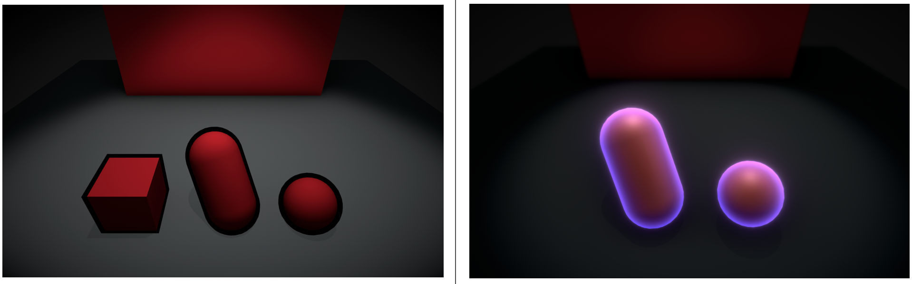

# Unity-Visual-Effect-Library

Make different kinds of typical **Visual Effects** which can be valuable references.

### The First Try: Projectile VFX
`Assets/_VFXs/ProjectileDemo`

 

 

### Electricity VFX
`Assets/_VFXs/ElectricityDemo`

 

### Global Fog Shader
`Assets/_Shaders/GlobalFog`

 

### Outline && OuterGlow Shader
`Assets/_Shaders/OuterGlowDemo`

`Assets/_Shaders/OutlineDemo`

 
